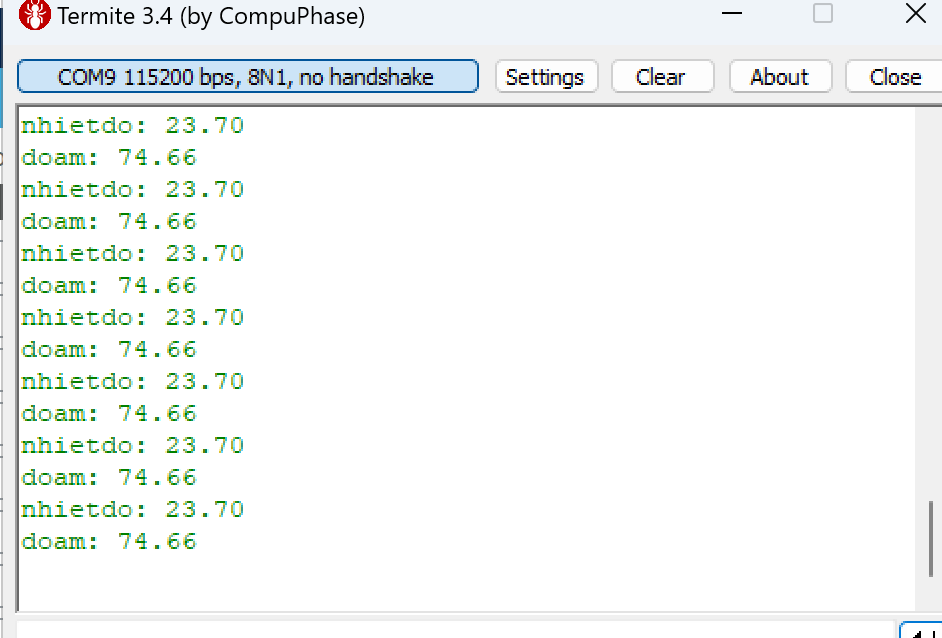

## Bài tập lớn cuối kì môn Thiết kế hệ thống nhúng kì 2024.1 (mã lớp 154748) - Nhóm 16
### Công việc nhóm đã triển khai:
- Phân tích tính toán tham số cho các Task
- Phân tích và lập trình 2 mô hình đơn nhiệm
- Phân tích và lập trình 2 mô hình đa nhiệm
- Triển khai ghép nối phần mềm, phần cứng và chạy thử nghiệm
### Kết quả thực nghiệm

- 
- 
